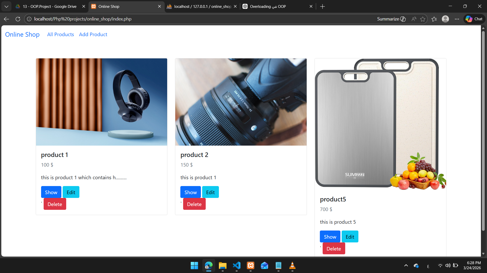
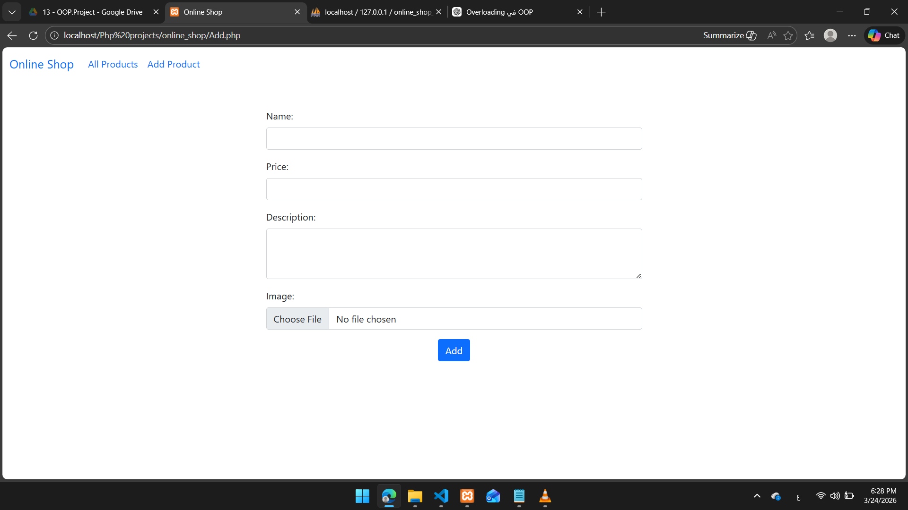
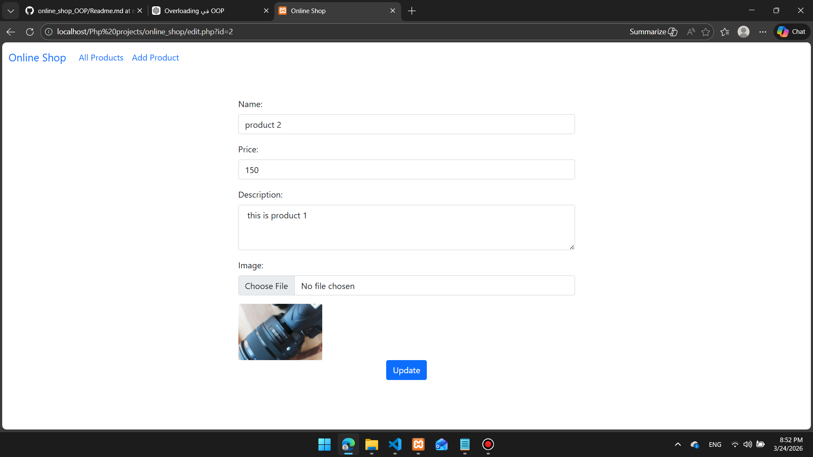
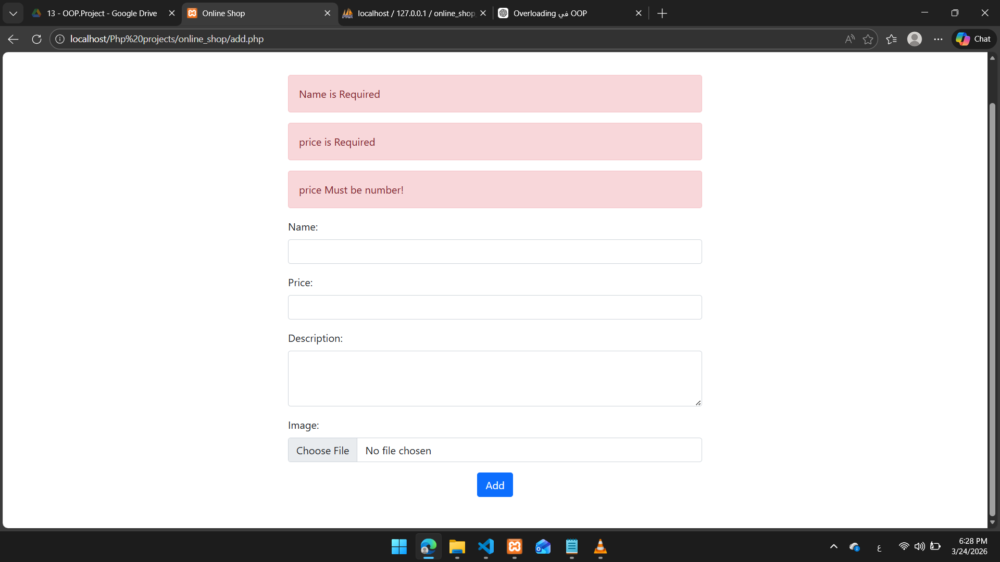

# 🛒 Online Shop System (OOP PHP)

A simple Online Shop system built using Core PHP with Object-Oriented Programming (OOP) principles.

The project allows users to manage products including adding, updating, deleting, and displaying products with image upload support.

## 🚀 Features

- Add new products
- Update existing products
- Delete products with image cleanup
- Display all products
- Image upload system
- Custom Validation Class
- Custom Session Class
- Request handling class
- Organized code using OOP principles

## 🛠️ Technologies Used

- PHP (Core PHP)
- MySQL
- OOP
- HTML / CSS / Bootstrap

## 📂 Project Structure

- /classes       → Custom classes (Conn, Validation, Session, Request, Image)
- /handlers      → Form handling (CRUD operations)
- /images        → Uploaded images
- /inc           → Shared files (header, footer)

## ▶️ How to Run

1. Clone the repository
2. Import the database file into MySQL
3. Update database connection in config file
4. Run project using XAMPP or any local server

## 📸 Screenshots
### 🏠 Home Page

### ➕ Add Product

### ✏️ Update Product

### ❌ Error Message

## 👨‍💻 Author

Karim Mohamed
